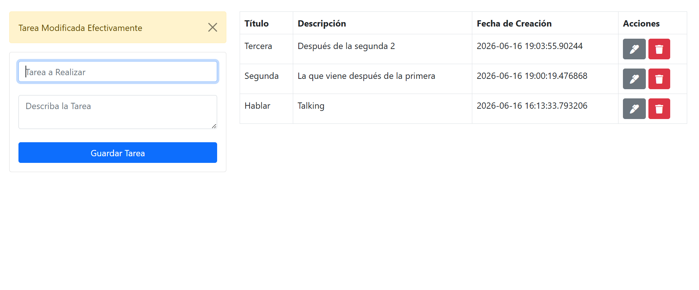

# Sistema de Gestion de Tareas PHP (Arquitectura MVC)

<p align="center">
  
</p>

Este proyecto es una aplicacion web para la administracion de tareas, refactorizada siguiendo el patron de arquitectura **Modelo-Vista-Controlador (MVC)** para garantizar un codigo limpio, seguro y facil de mantener.

## Descripcion General

La aplicacion separa la logica de negocio (Modelos), la interfaz de usuario (Vistas) y la gestion de peticiones (Controladores). Utiliza PHP 8.1 y PostgreSQL para la persistencia de datos, ofreciendo una experiencia CRUD completa.

## Tecnologias Utilizadas

- **Arquitectura:** MVC (Modelo-Vista-Controlador)
- **Lenguaje:** PHP 8.1
- **Base de Datos:** PostgreSQL 15
- **Contenerizacion:** Docker & Docker Compose
- **Frontend:** Bootstrap 5 & FontAwesome

## Estructura del Proyecto

```text
App-Tareas-PHP/
├── public/                 # Punto de entrada y activos publicos
│   └── index.php           # Enrutador principal
├── src/                    # Codigo fuente (Logica MVC)
│   ├── Config/             # Configuracion (Base de Datos)
│   ├── Controllers/        # Controladores de la aplicacion
│   ├── Models/             # Modelos de datos (Entidades y Consultas)
│   └── Views/              # Plantillas y vistas HTML
├── database/               # Scripts de inicializacion de DB
├── Dockerfile              # Configuracion de imagen PHP/Apache
└── docker-compose.yml      # Orquestacion de servicios
```

## Funcionalidades Principales

1.  **Registro de Tareas:** Creacion de actividades con validacion basica.
2.  **Visualizacion:** Listado dinamico ordenado por fecha de creacion.
3.  **Edicion:** Modificacion de titulo y descripcion.
4.  **Eliminacion:** Borrado permanente de registros.
5.  **Alertas:** Notificaciones de sesion (Flash messages) para confirmar acciones.

## Configuracion e Instalacion

### Ejecucion con Docker (Recomendado)

Si tiene Docker y Docker Compose instalados, ejecute:

```bash
docker-compose up -d --build
```

La aplicacion estara disponible en `http://localhost:8055`.

### Instalacion Manual

1.  Configure un servidor Apache apuntando el `DocumentRoot` a la carpeta `public/`.
2.  Asegurese de tener PHP 8.1+ con las extensiones `pgsql` y `pdo_pgsql`.
3.  Configure las variables de entorno para la base de datos o edite `src/Config/Database.php`.
4.  Ejecute el script `database/init.sql` en su instancia de PostgreSQL.

## Desarrollo y Mantenimiento

Gracias a la estructura MVC, para añadir nuevas funcionalidades:

- Añada metodos de consulta en `src/Models/Task.php`.
- Defina la logica de respuesta en `src/Controllers/TaskController.php`.
- Cree o modifique las plantillas en `src/Views/`.
